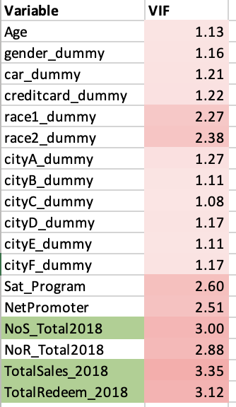

# Customer Churn, CLV & Segmentation — FGP Loyalty Program

A marketing-analytics case study on a multi-merchant customer loyalty program: predicting **customer churn**, estimating **Customer Lifetime Value (CLV)**, and segmenting the customer base with **K-means clustering** to drive targeted retention strategies. Built end-to-end in Excel.

> **Context:** University team project (UNSW, MARK5822 Marketing Analytics Tools, T1 2025). Dataset is disguised and re-generated by the course to remove any private/sensitive information.

## Business problem
FGP is a loyalty program shared by three independent merchants — a **F**ast-food chain, a **G**rocery chain, and a **P**etrol-station chain. Customers earn 1 point per $1 spent at any merchant, redeemable at any merchant. The program manager wanted to know: **how do we estimate a customer's value, predict whether they'll churn, and manage them accordingly?**

## Data
~3,200 customers across three tables — customer demographics + survey responses, purchase records, and redemption records (Jan 2018 – Sep 2019). After cleaning (recoding placeholder birth-year values, removing one implausible record), the working set was **3,212 customers**.

## Approach
1. **Preprocessing** — cleaned birth-year outliers, dummy-coded categorical variables (gender, race, home city, car/credit-card ownership, activity status), and derived an `Age` variable.
2. **Exploratory comparison** — profiled active (75.5%) vs. churned (24.5%) customers across demographics, satisfaction, and 2018 transactional behaviour.
3. **Churn model** — logistic regression with `Active2019` as the target.
4. **Model diagnostics** — checked multicollinearity via a correlation matrix and Variance Inflation Factor (all VIF < 5).
5. **Individual churn scores** — applied the fitted logistic equation to score every customer's churn probability.
6. **CLV** — estimated each customer's lifetime value from 2018 revenue, redemption cost (1 point = $0.01), a 10% discount rate, and retention rate.
7. **Segmentation** — K-means clustering on value + behaviour features, with K chosen by the elbow method and results visualised via PCA.

## Key results
- **Churn model:** ~90% classification accuracy, AUC ≈ 0.90, McFadden R² ≈ 0.43.
- **Churn drivers:** female customers, car owners, and those with higher program satisfaction / Net Promoter scores were *more* likely to stay; City D residents and customers with heavier 2018 redemption activity were *more* likely to churn.
- **Three segments** (K=3, silhouette ≈ 0.50):
  - **Stable customers (~72%)** — moderate CLV, high satisfaction, lowest churn; opportunity to lift spend via cross-merchant incentives.
  - **Enterprise users (~1%)** — very high spend (likely business buyers); retain with tailored contracts and dedicated service.
  - **High-risk users (~27%)** — low satisfaction, engagement, and spend; require careful ROI-aware pricing interventions.

## Results

### Churn model performance
The logistic regression separates active from churned customers well, with an **AUC ≈ 0.90**.


Overall classification accuracy is ~88%. Notably, the model is much stronger at identifying customers who *stay* (95%) than those who *churn* (64%) — a useful caveat for how it should be used in practice.


### Key churn drivers
Significant predictors (highlighted): being **female**, **owning a car**, and higher **program satisfaction** and **Net Promoter** scores all raise the odds of staying; **City D** residents and customers with more **2018 redemptions** are more likely to churn.


### Segmentation & value
<!-- ADD THESE: export from the workbook and drop into /images, then uncomment -->
<!--  -->
<!--  -->
<!--  -->
*(PCA cluster plot, elbow plot, and cluster-profile table go here — the segmentation half of the analysis.)*

<details>
<summary><b>Model diagnostics</b> (fit statistics, multicollinearity)</summary>

**Model fit**


**Variance Inflation Factor** — all values below 5, so multicollinearity is not a concern.



**Correlation matrix**


</details>

## What's in this repo
```
fgp-loyalty-analysis/
├── README.md
├── analysis/
│   └── Loyalty_Program_Data_FINAL.xlsx   # data prep, regression, churn scoring, correlation, VIF
├── images/                               # exported charts shown above
└── report/
    └── summary.md                        # written walkthrough of methods & findings
```
The `FINAL` workbook contains the full analytical trail: dummy-coded data, the logistic regression and its results, per-customer churn calculation, correlation analysis, and VIF.

## Tech & methods
Microsoft Excel (with a statistical add-in for logistic regression and diagnostics) · logistic regression · VIF / correlation diagnostics · CLV modelling · K-means clustering · PCA

## My role
<!-- Be specific and honest, e.g.: "Led the churn modelling and segmentation; built the regression, VIF, and CLV sheets; co-wrote the final report." Adjust to what you actually did. -->
Part of a 5-person team. I [describe your specific contributions here].

## Author
**Arun Kumar Selvaraj** — MSc Business Data Science & Decisions, UNSW
📧 arunsp2003@gmail.com

---
*Course brief and marking material are not included, as they are the property of the course instructor.*
